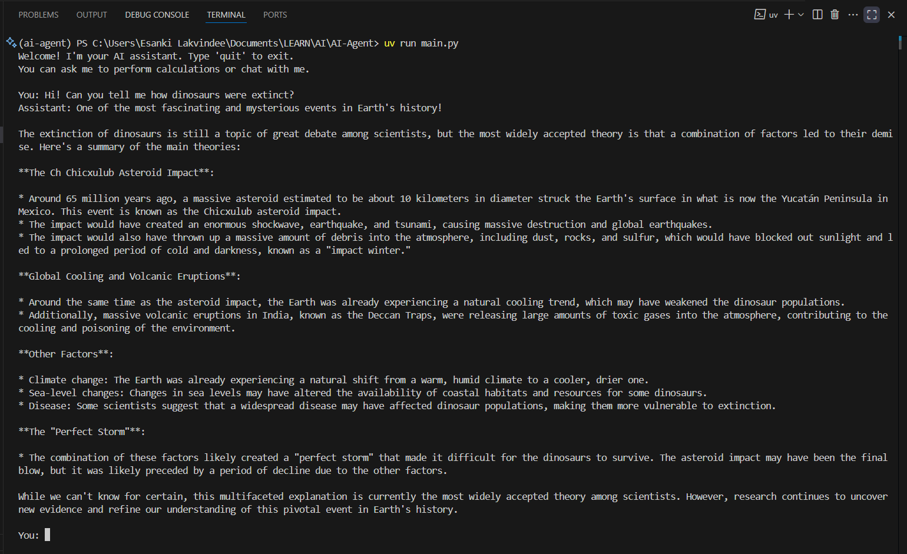
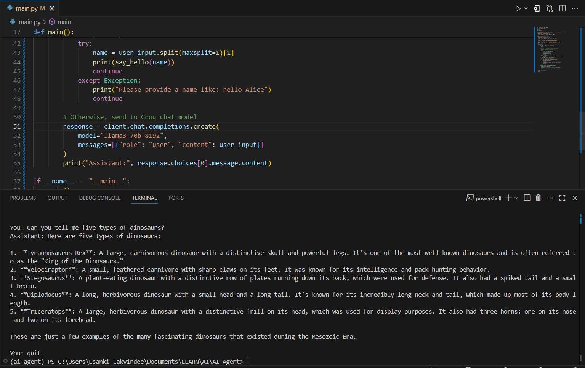
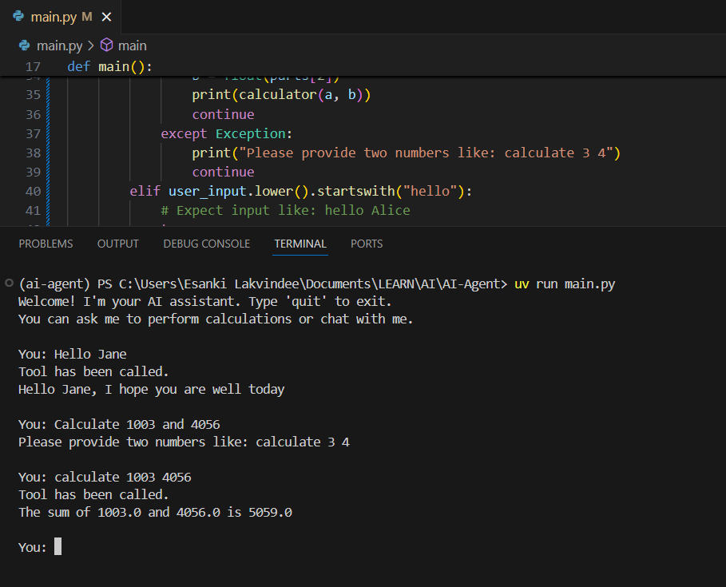

# AI Agent with Tool Access Using Groq API

This is an interactive command-line AI agent built in Python that can **access and execute custom tools** as well as answer general questions by leveraging Groq’s powerful AI model.

---

## Features

- **Custom Tool Integration:**  
  Execute specific functions on demand, such as:
  - Calculator: perform arithmetic operations
  - Greeting: send personalized messages

- **General AI Chat:**  
  Ask any open-ended question or have a conversation with Groq’s `llama3-70b-8192` language model.

- **Tool-Aware AI Agent:**  
  The agent intelligently detects commands to trigger tools or otherwise forwards the input to the AI chat model.

- **Command-line Interface:**  
  Easy interactive prompt with support for quitting anytime.

